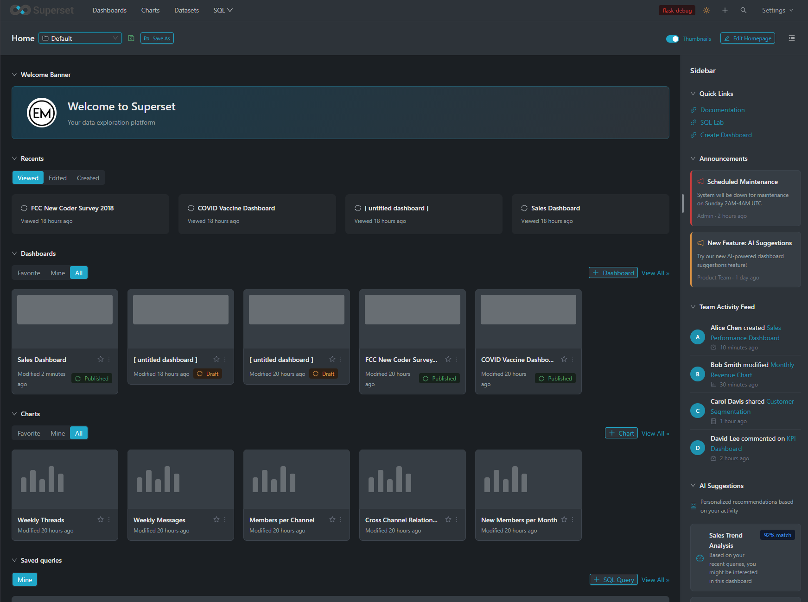

# Superset Homepage Builder Demo

A homepage builder demo for Apache Superset that allows full customization of the landing page through a drag & drop editor.




## Tech Stack

- **React 19** - UI Framework
- **Vite 7** - Build tool and dev server
- **Ant Design 6** - UI component library
- **Emotion** - CSS-in-JS for dynamic styling
- **@ant-design/icons** - Icon set

## Key Features

### 3-Region Layout

- **Main Area** - 12-column grid for primary widgets
- **Sidebar** - Collapsible side panel for secondary widgets

### Edit Mode

- Toggle Edit mode to enable customization
- Drag & drop widgets between regions
- Individual widget configuration (gear icon)
- Remove widgets (X icon)
- Save / Cancel / Reset layout changes

### Available Widgets

**Data & Analytics:**

- Recents - Recently viewed items
- Dashboards - Dashboard list
- Charts - Chart list
- Saved Queries - Saved SQL queries
- Embedded Chart - Embedded chart display
- KPI Cards - Key performance indicators
- Data Quality Alerts - Data quality notifications
- Query Results Preview - Query results preview

**Content:**

- Welcome Banner - Customizable welcome banner
- Markdown - Custom markdown content

**Communication:**

- Announcements - Announcements and communications
- Changelog - Change log
- Team Activity Feed - Team activity feed

**Navigation & Productivity:**

- Quick Links - Customizable quick links
- Pinned Dashboards - Favorite dashboards
- Search Box - Global search
- Recent Databases - Recently accessed databases

**Organization:**

- Tag Cloud - Tag cloud visualization
- Reports Schedule - Report scheduling
- Certifications - Certified dashboards, charts, and datasets

**AI-Powered:**

- AI Suggestions - Personalized recommendations based on user activity
- Natural Language Query - Ask questions about data in natural language

### Themes

- Dark and Light theme support
- Superset-style color customization

## Quick Start

1. Install dependencies:

   ```bash
   npm install
   ```

2. Start the development server:

   ```bash
   npm run dev
   ```

3. Open http://localhost:5173

## Available Scripts

```bash
npm run dev      # Start development server
npm run build    # Production build
npm run preview  # Preview production build
npm run lint     # Run ESLint
```

## Project Structure

The project follows a modular architecture for better maintainability and scalability:

```
demo-app/src/
├── config/                     # Configuration files
│   ├── theme.js               # Dark/Light theme tokens
│   ├── widgetTypes.jsx        # Widget definitions
│   └── index.js               # Re-exports
│
├── constants/                  # Constants and mock data
│   ├── mockData.js            # Mock data for demo
│   ├── initialLayout.js       # Default layouts and presets
│   └── index.js               # Re-exports
│
├── context/                    # React Context providers
│   ├── ThemeContext.jsx       # Dark mode context
│   └── index.js               # Re-exports
│
├── hooks/                      # Custom React hooks
│   ├── useLocalStorage.js     # localStorage persistence
│   ├── useDragAndDrop.js      # Drag & drop logic
│   ├── useHomepageState.js    # Homepage state management
│   └── index.js               # Re-exports
│
├── components/
│   ├── layout/                # Layout components
│   │   └── DropZone.jsx       # Drop zone for drag & drop
│   │
│   ├── widget/                # Widget system components
│   │   ├── WidgetWrapper.jsx      # Widget container with controls
│   │   ├── WidgetPicker.jsx       # Widget selection modal
│   │   ├── WidgetRenderer.jsx     # Widget content dispatcher
│   │   └── ConfigModalContent.jsx # Widget configuration forms
│   │
│   └── widgets/               # Widget implementations (22 widgets)
│       ├── data/              # RecentsWidget, DashboardsWidget, etc.
│       ├── content/           # WelcomeBannerWidget, MarkdownWidget
│       ├── analytics/         # KpiCardsWidget, DataQualityAlertsWidget, etc.
│       ├── communication/     # AnnouncementsWidget, ChangelogWidget, etc.
│       ├── navigation/        # QuickLinksWidget, SearchBoxWidget, etc.
│       ├── organization/      # TagCloudWidget, CertificationsWidget, etc.
│       └── ai/                # AiSuggestionsWidget, NaturalLanguageQueryWidget
│
├── pages/                      # Page components
│   └── HomepageBuilder.jsx    # Main page component (orchestrator)
│
├── App.jsx                    # React entry point
├── main.jsx                   # Application bootstrap
└── index.css                  # Global styles
```

### Architecture Benefits

| Aspect | Description |
|--------|-------------|
| **Separation of Concerns** | Each module has a single responsibility |
| **Testability** | Components can be unit tested in isolation |
| **Reusability** | Widgets are independent and reusable |
| **Maintainability** | Easy to find and modify specific functionality |
| **Scalability** | New widgets can be added without touching core logic |
| **Code Splitting** | Enables lazy loading of widget components |

### Adding a New Widget

1. Create a new widget component in `src/components/widgets/[category]/`
2. Export it from the category's `index.js`
3. Add the widget definition to `src/config/widgetTypes.jsx`
4. Add the component to the mapping in `src/components/widget/WidgetRenderer.jsx`

## License

MIT
